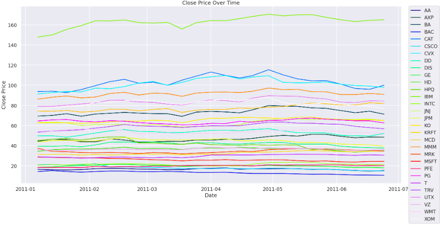
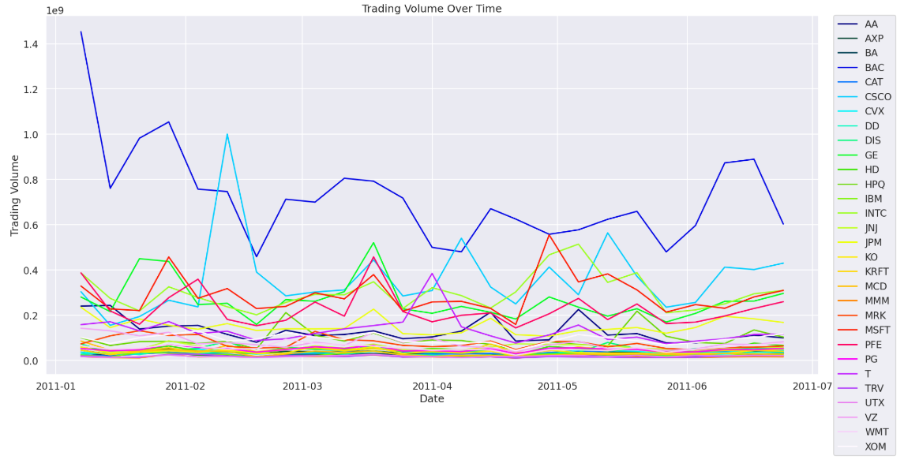
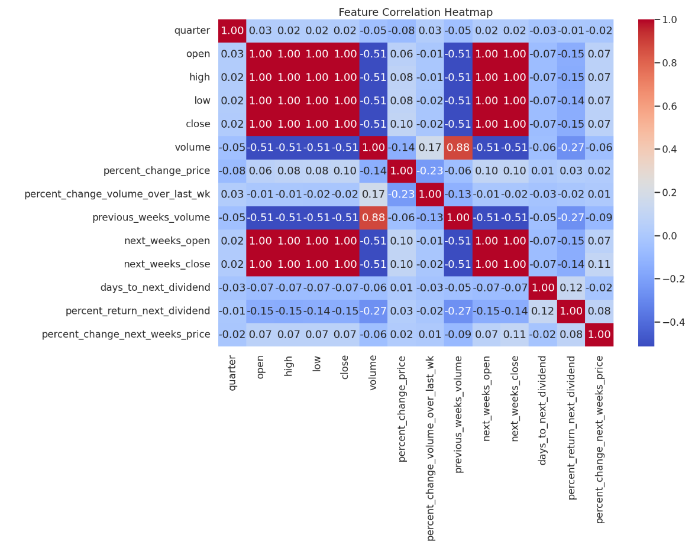

# PROJECT CSE 150A: AI PROBABILISTIC MODELS

## [Dataset link](https://archive.ics.uci.edu/dataset/312/dow+jones+index)

## [Jupyter Notebook](https://colab.research.google.com/drive/1ysVW8dKDKrU8gJPSCyoAYanBV9dPKj4Y#scrollTo=nFW2Pt4iCL3a)

## Group Members 
Dat To Ung\
Hoang Le\
Uyen Le\
Yifan Zhu\
Dylan Nguyen

---

## Project Abstraction: 
In this project, we propose a utility-based AI agent that predicts market trends using a time-series dataset from UCI containing daily price data that was published on October 24th, 2014. Instead of performing a continuous-value regression on opening/closing prices or trading volume, we quantize these features into discrete intervals, by defining thresholds for small, medium, large price changes. This allows our agent to classify each day’s market behavior as “Up/Down/Stable” capturing directional trends rather than generating a single numeric forecast. Operating within the PEAS framework, the environment is the stock market, the performance measure is risk-adjusted profit, the actuators are buy/sell/hold trades, and the sensors are historical market observations. The agent continually updates its belief over market states and selects the action that maximizes expected returns under uncertainty. Through this probabilistic approach, we aim to demonstrate how interpreting and exploiting hidden market regimes can lead to more informed and adaptive trading strategies than a simple static predictor. In a regression task, we would just simply predict a numerical value such as the price of the stock or the percentage change in the price. But our task is different from a regression task in that our models will predict where the stock price will fall today. We want our model to detect the trends rather than the specific numbers. 

---

## PEAS Framework  

Our AI agent operates within the **PEAS framework** (Performance measure, Environment, Actuators, Sensors) as follows:  

### **Performance Measure:**  
The agent’s goal is to **predict market trends** to make optimal **buy/sell/hold** decisions rather than predicting explicit numeric forecasts. Success is measured by **risk-adjusted profit** based on:  
- **Prediction accuracy** of classifying each day's market behavior as **Up/Down/Stable**.  
- **Correct identification** of **bullish or bearish market regimes** over a given time frame.  
- **Error in estimating the percentage change in price** for the next week (lower error is better).  

### **Environment:**  
The environment is the **stock market**, modeled using the **Dow Jones Index dataset from UCI**, containing daily price and volume data from 2014.  

### **Actuators:**  
The agent interacts with the market by executing **three possible trading actions**:  
- **Buy** – Purchase stocks in anticipation of a price increase.  
- **Sell** – Sell stocks to lock in profits or prevent losses.  
- **Hold** – Maintain the current position when there is uncertainty.  

### **Sensors:**  
The agent gathers observations from **historical market data**, including **opening and closing prices, high and low prices, and trading volume**. These features are **quantized into discrete intervals** (e.g., small, medium, large price changes) to categorize daily market behavior as **Up, Down, or Stable**. The agent **continuously updates its belief over market states** based on these observations.  

---

## What is the “World” Like?  
The agent operates in a **financial market** where stock prices fluctuate due to complex, often hidden factors. The world is **uncertain and dynamic**, meaning that the same market conditions may not always lead to identical outcomes. The agent must **learn from past patterns** to infer hidden market trends. By **interpreting market shifts probabilistically**, the agent aims to make informed trades that yield **higher cumulative returns** over time.  

---

## **Agent Type: Utility-Based AI Agent**  

Our AI agent is a **utility-based agent** because it selects actions (**Buy/Sell/Hold**) based on **maximizing expected returns under uncertainty**. By predicting stock movements (**Up/Down/Stable**), it evaluates different actions using a **utility function** that considers **profitability, risk, and market conditions**.  

Unlike a **goal-based agent** that focuses on achieving a fixed objective, our agent **compares the potential outcomes of different decisions** and chooses the one with the **highest expected reward**. This approach allows for **more adaptive and informed trading strategies** rather than relying on static predictions.  

---

## **Agent Setup and Probabilistic Modeling**  

Our agent is designed as a **probabilistic classifier** that predicts **market trends** by analyzing **historical stock price movements**. Instead of using **continuous-value regression**, we **discretize price changes** into categories (**Up, Down, Stable**) and model the **probability distribution** of these outcomes.  

### **Agent Setup:**  

1. **Feature Engineering:**  
   - We extract key **stock price features**: **opening price, closing price, highest price, lowest price, and trading volume**.  
   - These features are **quantized into discrete intervals** representing **small, medium, or large changes** in price.  

2. **Probabilistic Modeling Approach:**  
   - The agent uses **probabilistic inference** to determine the **likelihood of market trends** given the **volume change and price change**.  
   - It estimates **P(Trend | Market Features)**, where the **Trend** is **Up/Down/Stable**.  
   - This allows the model to **infer hidden market regimes** and adjust predictions dynamically.  

3. **Decision-Making:**  
   - The agent selects **Buy/Sell/Hold** actions based on its **estimated probabilities**.  
   - If **P(Up) is high**, the agent may **Buy**; if **P(Down) is high**, it may **Sell**; if **P(Stable)**, it may **Hold**.  
   - This decision process **relies on probability distributions** rather than **deterministic rules**.  

### **How It Fits in Probabilistic Modeling:**  
Our agent applies **probabilistic classification** rather than **rule-based heuristics**. By **estimating the probability** of stock movements, it accounts for **uncertainty in financial markets** and avoids **overfitting to specific trends**. This makes it **more adaptable** compared to simple deterministic models.  

---

## Methods Overview:
### Data Exploration

There are 30 types of stocks in our dataset with 750 rows. 


The below image is the descriptive of our dataset.


The below plot shows the closing prices of multiple stocks over time, demonstrating stable trends with moderate fluctuations. Some stocks have consistently higher values, while other stocks remain in lower price ranges.

\
The plot illustrates trading volume variations over time, showing significant fluctuations for certain stocks. As you can see, some stocks experience periodic spikes.

\
The following heatmap visualizes the correlation between different stock-related features; red signifies positive correlation, blue signifies negative correlation, and white signifies no correlation.


### Data Preprocessing
1.  Imputation:

For data preprocessing, there are some missing values for 'percent_change_volume_over_last_wk' and 'previous_weeks_volume':


So we decided to fill in the missing values with the median of each type of stock. 

2. Standardization
 noticed that there are a lot of '$' signs in the data, so we decided to remove all the dollar signs ('$'). Finally, we added 3 more new columns which are 'PriceChange',	'VolumeChange', and 'MarketTrend'. 

3. Feature expansion:
The data for each of these columns is from converting the continuous values of 'percent_change_price', 'percent_change_next_weeks_price', and 'percent_change_volume_over_last_wk' to discrete values.  

### Finalized dataframe:


- quarter: the yearly quarter (1 = Jan-Mar; 2 = Apr=Jun).
- stock: the stock symbol (see above)
- date: the last business day of the work (this is typically a Friday)
- open: the price of the stock at the beginning of the week
- high: the highest price of the stock during the week
- low: the lowest price of the stock during the week
- close: the price of the stock at the end of the week
- volume: the number of shares of stock that traded hands in the week
- percent_change_price: the percentage change in price throughout the week
- percent_chagne_volume_over_last_wek: the percentage change in the number of shares of stock that traded hands for this week compared to the previous week
- previous_weeks_volume: the number of shares of stock that traded hands in the previous week
- next_weeks_open: the opening price of the stock in the following week
- next_weeks_close: the closing price of the stock in the following week
- percent_change_next_weeks_price: the percentage change in price of the stock in the following week
- days_to_next_dividend: the number of days until the next dividend
- percent_return_next_dividend: the percentage of return on the next dividend
- PriceChange: categorizes percent_change_price as "Down" if it's below -1.5, "Up" if above 1.5, and "Stable" otherwise.
- VolumeChange: follows the same logic but based on percent_change_volume_over_last_wk.
- MarketTrend: determined using percent_change_next_weeks_price, labeling it as "Bearish" if below -1.5, "Bullish" if above 1.5, and "Neutral" otherwise.

## Model 1: Bayesian Network
# Overview

This model uses the dataset to compute the probability of each kind of Market Trend of each stock given the Volume Change (in categorical) and the Price Change (in categorical). Formula:

$$
P(\text{MarketTrend}=y \mid \text{VolumeChange}=x_1, \text{PriceChange}=x_2) = \frac{\text{Number of } (\text{MarketTrend}=y, \text{VolumeChange}=x_1, \text{PriceChange}=x_2)}{\text{Number of } (\text{VolumeChange}=x_1, \text{PriceChange}=x_2)}
$$

Then, when the user gives the Volume and Price Change (in categorical) and asks the agent to suggest selling/buying/holding stock, the model will try to find the market trend of this stock based on the probability and give the user a suggestion.

# Code
**Agent Setup**
```
class BayesianNetwork:
    def __init__(self, nodes):
        self.nodes = nodes  # List of nodes (variables)
        self.parents = {node: [] for node in nodes}  # Parent relationships
        self.cpt = {}  # Store CPT per stock

    def add_edge(self, parent, child):
        """Define dependency relationships between nodes."""
        self.parents[child].append(parent)

    def set_cpt(self, stock, cpt):
        """Set the conditional probability table, specific to a stock."""
        if stock not in self.cpt:
            self.cpt[stock] = {}
        self.cpt[stock] = cpt

    def get_probability(self, stock, evidence):
        """Compute the probability of a node given the evidence and stock-specific CPT."""
        if stock not in self.cpt:
            return 1/3  # Return 1/3 probability if stock CPT is missing

        # Compute conditional probability using Bayes' Theorem
        key = tuple(evidence.values())
        probabilities = {}
        # If evidence is not in CPT, return 1/3 for each key of market trend
        # Else return the {market_trend,P(market_trend|evidences)
        if key not in self.cpt[stock]:
          probabilities = {k: 1/3 for k in ['Low', 'High', 'Medium']}
        else:
          for k, p in self.cpt[stock][key].items():
            probabilities[k] = p
        return probabilities

    def infer(self, stock, evidence):
      """Perform inference to determine the most likely market trend for a given stock."""
      probabilities = self.get_probability(stock, evidence)

      # Get max probability value
      max_prob = max(probabilities.values())

      # Get all trends that share the max probability
      best_trends = [k for k, v in probabilities.items() if v == max_prob]

      if len(best_trends) == 3:
          return 'Neutral'
      elif len(best_trends) == 2:
        if 'Bearish' in best_trends and 'Bullish' in best_trends:
          return random.choice(best_trends)
        elif 'Bearish' in best_trends and 'Neutral' in best_trends:
          return 'Bearish'
        else:
          return 'Neutral'
      else:
          return best_trends[0]  # Return the single best trend

    def suggested_decision(self, MarketTrend_pred):
      if MarketTrend_pred == 'Bearish':
        return 'Sell'
      elif MarketTrend_pred == 'Bullish':
        return 'Buy'
      else:
        return 'Hold'
```
**Training**
```
# Training model
# Define nodes: Market trend prediction
nodes = ["MarketTrend", "VolumeChange", "PriceChange"]
# Create Bayesian Network
bn = BayesianNetwork(nodes)
# Define dependencies
bn.add_edge("VolumeChange", "MarketTrend")
bn.add_edge("PriceChange", "MarketTrend")

# Assign CPTs for each stock
for stock, cpt in cpt_transformed.items():
  bn.set_cpt(stock, cpt)
```
# Results:

Currently, our agent only has 41.33% accuracy. We think this accuracy is not too high because we assumed that the price change and the volume change are independent. Also, when we converted the volume change, the price change, and the real market trend from numerical to categorical, we used the threshold is 1.5, which is not the most efficient for this model. We think we could improve our model if we have a larger dataset to train and test this model as well as we could try to figure out the most efficient threshold for standardizing. 
# Conclusion:

The prediction accuracy of our Naive Bayes model is 41.333%, demonstrating that the model is an improvement over guessing stock trends at random, but not by very much. Perhaps we would have to find an alternative method to clean the data instead of using placeholder values.  We can also improve our agent with a bigger dataset and more features. Our agent can have more historical stock data with more data in our dataset. With the improvement of the historical stock data, the agent can calculate the probability more accurately and more reliably. Improving our features would also make our agent more reliable because our current agent is oversimplifying the market dynamic by assuming the price change and volume change are independent. By having more features, we can improve our agent’s structure which also boosts the accuracy of our agent. There are many challenges that our agent can have, one of them is the independence assumption. Since this is our first agent, we are assuming the volume change and the price change are independent. But in the real world, these features are correlated, and ignoring the relationship can lead to the underperformance of our agent. With the limitation of our dataset, our agent will be overfitting and have bad predictions, which can lead to poor decision-making. Also, using a fixed threshold is not optimal for all types of stocks, which can also lead to bad output for our agent.
## Model 2: HMM Agent
# Overview
This model uses a Hidden Markov Model (HMM) to capture the temporal dependencies in stock market behavior. We define three hidden states—Bullish, Bearish, and Neutral—to represent the underlying market conditions, and we estimate the transition probabilities between these states based on historical data. We also compute emission probabilities that describe how likely we are to observe certain price and volume changes when the market is in a particular hidden state. Once the HMM is trained, it uses these transition and emission probabilities to infer the most probable sequence of hidden states for any new set of observed price and volume changes. Based on the inferred market state, the agent then provides a recommendation to buy, sell, or hold the stock.
Formally, let $$\(S_t\)$$ denote the hidden state at time $$\(t\)$$ and $$\(O_t\)$$ the observation (price change and volume change) at time $$\(t\)$$. We specify three key components:

- The initial state distribution $$\pi_i = P(S_1 = i)$$
- The transition probabilities $$a_{ij}$$ = $$P(S_{t+1}$$ = $$j \mid S_t = i)$$
- The emission probabilities $$b_{i(O_t)}$$ = $$P(O_t \mid S_t = i)$$

The joint probability of a sequence of hidden states $$\(S_{1:T}\)$$ and observations $$\(O_{1:T}\)$$ is given by:

$$
P(S_{1:T} \, O_{1:T})
= \pi_{S_1} b_{{S_1}(O_1)}
\prod_{t=2}^{T} \bigl(a_{S_{t-1}, S_t} b_{{S_t}(O_t)}\bigr).
$$

## Model variables and structure interactions

### Data Exploration
- Stock: Identify the specific stock
- Market Trend: Hidden state in model
- Date: Time in sequence
- Volume Change: The observation 1
- Price Change: The observation 2
  


### Structure
- ***Hidden states `states`:*** Market trend ("Bullish", "Bearish", "Neutral")
- ***Observations***: Pair of PriceChange and VolumeChange
- ***Initial Probabilities `init_prob`***: represent the probability of each state at the beginning. This kind of probability is computed by finding the frequency of each state `s` in the training data
  
$$\verb|init_prob[s]| = \pi(s) = \frac{\text{Number of } s}{\text{Total observations}}$$

- ***Transition Probabilities `trans_prob`***: represent the probability of the transition from state $s_i$ to state $s_j$. This kind of probability is computed by counting consecutive occurrences of market trends in the training set.

$$
\verb|trans\_prob[s_i][s_j]| = P(s_j \mid s_i) = \frac{\text{Count}(s_i \to s_j)}{\sum_{s'} \text{Count}(s_i \to s')}
$$

- ***Emission Probabilities `emit_prob`***: represent the probability distribution over the possible observations. This is computed by counting the frequency of the appearances of state `s` and each tuple ($o_1,o_2$) as `o`(represents for tuple (PriceChange, VolumeChange))

$$
\verb|emit\_prob[s][o]| = P(o \mid s) = \frac{Count(s,o)}{\text{Total observations in state s}}
$$

### Interations and Algorithms (Model Analysis)

- ***Constructor***: Initialize value of `states`, `init_prob`, `trans_prob` and `emit_prob`

- ***Viterbi Algorithm***: Infer the most probable sequence of hidden states.

  In this algorithm, first of all, we computed the weight log probability in the first observation using the formula below:
  
$$
V[0][s] = \log(\pi(s) + \epsilon) + w_0 \times \log\big(P(o_0 \mid s) + \epsilon\big)
$$

   where: $\epsilon = 1e-12$ is the small value to avoid log(0) and $w_0$ is the weight of the first observation

   Then, for each subsequent observation $o_t$ with weight $w_t$, evaluate each possible previous state $s_i$ and update to the one that we can get the maximum probability of reaching the current state $s_j$, using the formula below:

$$
V[t][s_j] = \max_{s_i} \big[  V[t-1][s_i] + w_t \times \big(\log(P(s_j \mid s_i) + \epsilon) + \log(P(o_t \mid s_j) + \epsilon)\big) \big]
$$

All the possible sequences of states are stored in a dictionary. The algorithm will trace back from the state with the highest probability at the final time t.

- ***Action Suggestion***: As model 1, this method is used to return an action suggestion which depends on the predicted future hidden states.

# Code
**Agent Setup**
```
class HMM:
    def __init__(self, states, init_prob, trans_prob, emit_prob):
        self.states = states              # ['Bullish', 'Bearish', 'Neutral']
        self.init_prob = init_prob        # Dictionary of initial probabilities
        self.trans_prob = trans_prob      # Transition probabilities dictionary
        self.emit_prob = emit_prob        # Emission probabilities dictionary


    def viterbi(self, obs_seq, weights):
        """
        Runs the Viterbi algorithm on an observation sequence with weights.
        obs_seq: list of observations (tuples)
        weights: list of weights (one per observation)
        Returns the most likely state sequence and the probability of that path.
        """
        V = [{}]  # V[t][state]: maximum log probability ending in state at time t.
        path = {}

        # Initialization: Use the weighted log emission probability.
        for state in self.states:
            emit = self.emit_prob.get(state, {}).get(obs_seq[0], 1e-6)
            V[0][state] = np.log(self.init_prob.get(state, 1e-6) + 1e-12) + weights[0] * np.log(emit + 1e-12)
            path[state] = [state]

        # Recursion: For each subsequent observation.
        for t in range(1, len(obs_seq)):
            V.append({})
            new_path = {}
            for curr_state in self.states:
                max_prob, best_prev = max(
                    (
                        V[t-1][prev_state] +
                        weights[t] * (np.log(self.trans_prob.get(prev_state, {}).get(curr_state, 1e-6) + 1e-12) +
                                      np.log(self.emit_prob.get(curr_state, {}).get(obs_seq[t], 1e-6) + 1e-12)),
                        prev_state
                    )
                    for prev_state in self.states
                )
                V[t][curr_state] = max_prob
                new_path[curr_state] = path[best_prev] + [curr_state]
            path = new_path

        final_state = max(V[-1], key=V[-1].get)
        return path[final_state], np.exp(V[-1][final_state])

    def suggest_action(self, state):
        """Suggests a trading action based on the predicted hidden state."""
        if state == 'Bullish':
            return 'Buy'
        elif state == 'Bearish':
            return 'Sell'
        else:
            return 'Hold'

```
**Training**
```
# Dictionary to store HMM parameters for each stock
hmm_params = {}
# Training model
for stock in stocks:
    stock_df = df[df['stock'] == stock].sort_values('date')
    n = len(stock_df)
    train_size = int(np.floor(n * 0.8))
    training_data = stock_df.iloc[:train_size]

    # Compute initial probabilities from the distribution of MarketTrend in training data.
    overall_counts = training_data['MarketTrend'].value_counts().to_dict()
    total_overall = sum(overall_counts.values())
    init_prob = {state: count / total_overall for state, count in overall_counts.items()}

    # Compute transition probabilities based on consecutive MarketTrend values.
    trans_counts = defaultdict(lambda: defaultdict(int))
    market_trends = training_data['MarketTrend'].tolist()
    for i in range(len(market_trends) - 1):
        current_state = market_trends[i]
        next_state = market_trends[i + 1]
        trans_counts[current_state][next_state] += 1
    trans_prob = {}
    for state, next_counts in trans_counts.items():
        total = sum(next_counts.values())
        trans_prob[state] = {s: count / total for s, count in next_counts.items()}

    # Compute emission probabilities for each state using observed (PriceChange, VolumeChange) tuples.
    emit_counts = defaultdict(lambda: defaultdict(int))
    for _, row in training_data.iterrows():
        state = row['MarketTrend']
        obs = (row['PriceChange'], row['VolumeChange'])
        emit_counts[state][obs] += 1
    emit_prob = {}
    for state, obs_counts in emit_counts.items():
        total = sum(obs_counts.values())
        emit_prob[state] = {obs: count / total for obs, count in obs_counts.items()}

    # Save the parameters and the training size for the current stock.
    hmm_params[stock] = {
        'init_prob': init_prob,
        'trans_prob': trans_prob,
        'emit_prob': emit_prob,
        'train_size': train_size
    }
```
# Results:
Our Hidden Markov Model agent achieved an overall accuracy of 35%. While this suggests that the model is capturing some aspects of the underlying market dynamics, there is still room for improvement. One possible reason for the modest accuracy is the reliance on a limited feature set and a relatively small dataset, which can prevent the model from learning robust transition and emission probabilities. Additionally, the thresholds used to categorize price and volume changes may not be optimal for all stocks or market conditions. By refining these thresholds, incorporating more relevant features, and training on a larger dataset, we believe the agent’s accuracy could be improved.
# Conclusion:
The prediction accuracy of our Hidden Markov Model is 35%, suggesting that the model makes a slight improvement over guessing market trends at random. One possible reason for this limited performance is, again, the reliance on a relatively small dataset and placeholder values, which can introduce biases and prevent the model from making accurately estimations. Increasing the size and quality of the dataset could significantly enhance the reliability of these probability estimates, ultimately leading to better predictions.\
Our HMM also simplifies the market dynamics by restricting the feature set to price change and volume change. In reality, market behavior is shaped by many interdependent factors, and ignoring some of these relationships can lead to underperformance. Introducing additional features such as more granular historical information may provide the model with a richer context, allowing it to capture the complex interactions that drive stock movements. Similarly, using a fixed threshold to decide whether to buy, sell, or hold may not be appropriate for all stocks or market environments, so adopting adaptive thresholds could improve decision-making.\
Another limitation arises from the Markov assumption itself, which says that the next state depends solely on the current state. This assumption often oversimplifies real-world stock behavior, as events or trends can persist beyond a single timestep or be influenced by external factors that the model does not capture. Overall, while the HMM approach offers a useful framework for capturing some aspects of temporal structure in the market, it still requires further refinement in terms of data quality, feature engineering, and modeling assumptions to achieve better predictive power.
In the next model, we will use reinforcement learning to improve our decision-making of our model. We hope this approach will give us a better accuracy compared to the previous and this model. 

## Model 3: Reinforcement Learning Agent
# Overview


## Model variables and structure interactions
### Structure

### Interations and Algorithms (Model Analysis)

# Code

# Results:
Our Reinforcement Learning Model agent achieved an overall accuracy of 42%, slightly outperforming the Hidden Markov Model and the Bayesian Network agents. This indicates that the model is also capable of capturing some aspects of the market’s behavior, though it can be improved upon. A potential factor contributing to the modest accuracy is the limited state representation, relying only on price and volume changes, which may not fully capture the complexity of market trends. Additionally, the model’s performance could be affected by the relatively small dataset and the fixed hyperparameters, such as learning rate, discount factor, and exploration rate, which may not be optimal across different stocks. Further improvements could be achieved by expanding the feature set, fine-tuning hyperparameters, and incorporating longer training periods to allow the agent to learn more robust policies.

# Conclusion:


## Citation: 
For this project, we used ChatGPT to help us understand the Viterbi algorithm used in the HMM model. We also used ChatGPT to check our formulas for the joint probability of the sequence of hidden states and observation of the HMM model. 
